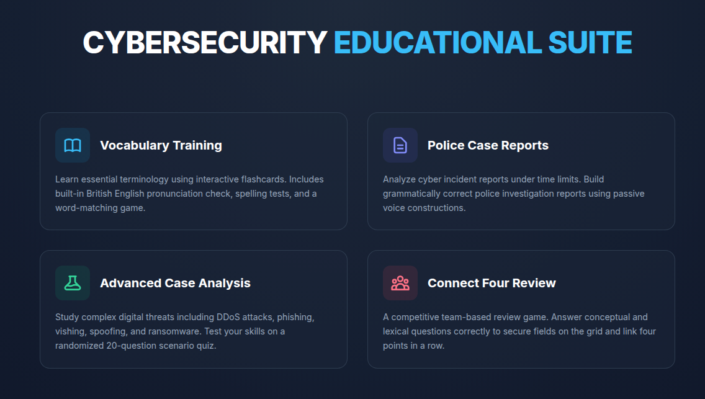
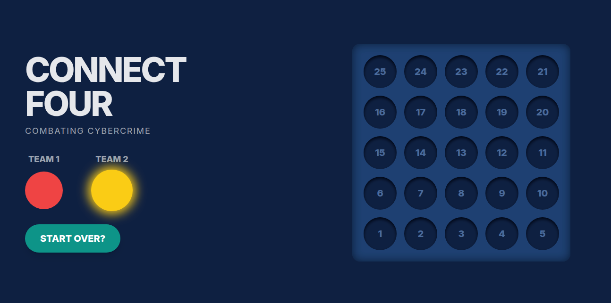

# Cybersecurity Educational Suite

An interactive web-based toolkit designed for learning and practicing cybersecurity terminology and crime analysis. 

This project was created as part of a scientific research paper during my studies at the Academy of the Ministry of Internal Affairs of the Republic of Belarus.

## Live Demo
**[GitHub Pages](https://a-a-borodin.github.io/english-test/)**

## Preview

  
  

## Development Method
Rapidly prototyped using AI-assisted development.

## Project Structure
* `index.html` - Main navigation dashboard.
* `lesson-1-vocabulary.html` - Vocabulary trainer featuring British English text-to-speech, spelling exercises, and a matching game.
* `lesson-1-cases.html` - Cyber incident reports simulator (focusing on passive voice grammar construction).
* `lesson-2-cases.html` - Cybercrime theory block and a randomized 20-question scenario quiz.
* `game-connect-four.html` - Team-based "Connect Four" review game using cybersecurity trivia.

## Tech Stack
* HTML5 / CSS3 (Tailwind CSS via CDN)
* Vanilla JavaScript
* Web Speech API (used for vocabulary pronunciation checks)

## How to Run
No installation or local server setup is required. Simply open `index.html` in any modern web browser.
